# 準備するもの
- Windowsパソコン上で、FileZilla・PowerShellが使える

- Linuxサーバーの接続情報（ユーザー名、パスワード、ホスト名/IP）
  - ユーザー名・パスワード：社内システムを利用されるときのもの
  - ホストIP：10.1.185.55

---
# 手順
0. FileZillaのインストール<br>
    ①FileZillaのサイトにアクセスします。<br>
    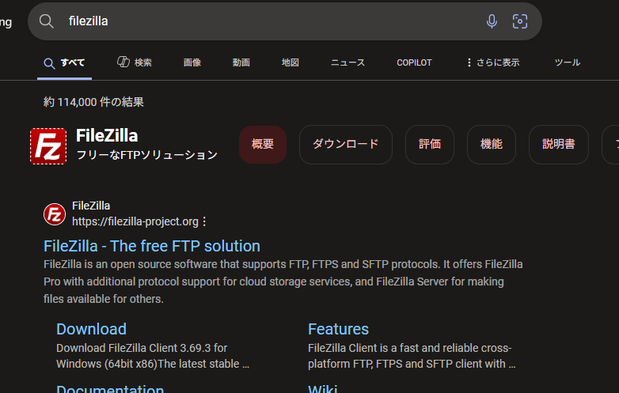

    ②ダウンロードしてインストールします。<br>
    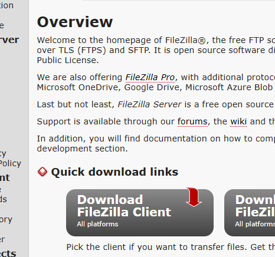<br>
    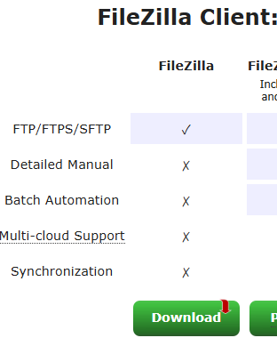<br>
    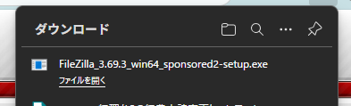<br>
    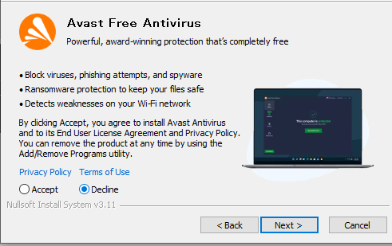<br>
    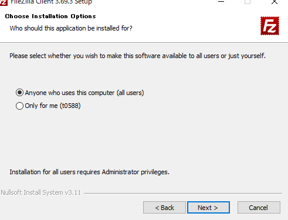<br>
    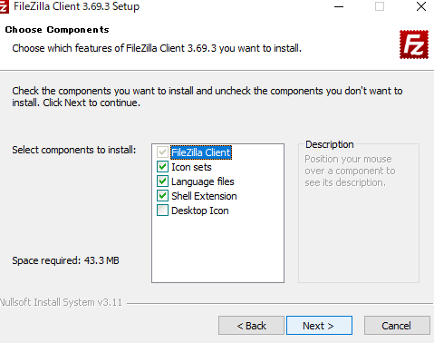<br>
    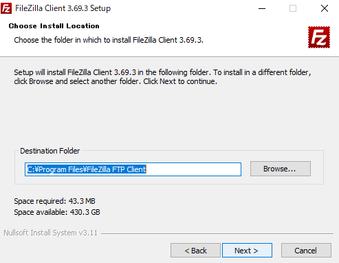<br>
    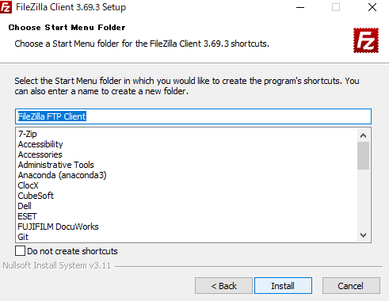<br>

---

1. FileZillaで音声ファイルをサーバーへコピー

    ① FileZillaの起動と接続
      1. FileZillaを起動します。<br>
        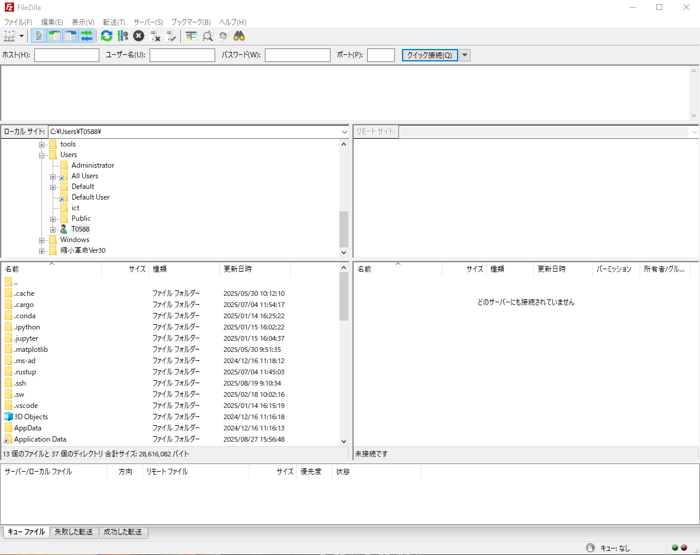
      
      2. 画面上部の欄に以下を入力します。
         - ホスト： サーバーのIPアドレスまたはホスト名
         - ユーザー名・パスワード： サーバーログイン情報
         - ポート： 22（必ず「22」と入力してください）

         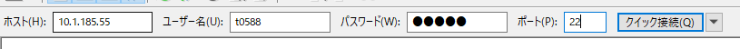

      3. 「クイック接続」をクリックします。
         - 保存していない接続先は警告が出ますが、「OK」でいいです。
         - 「常にこのホストを信用し、この鍵をキャッシュに追加」にチェックを入れると、次回からこの警告はでません。<br>

         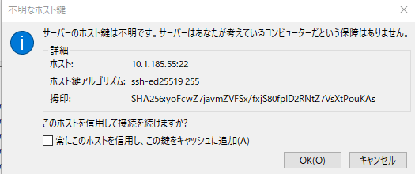

    ② サーバーの作業ディレクトリ確認・作成
      1. 右側（サーバー側）のウィンドウで、ご自分のホームディレクトリ（例 /home/ユーザー名）を開きます。<br>
        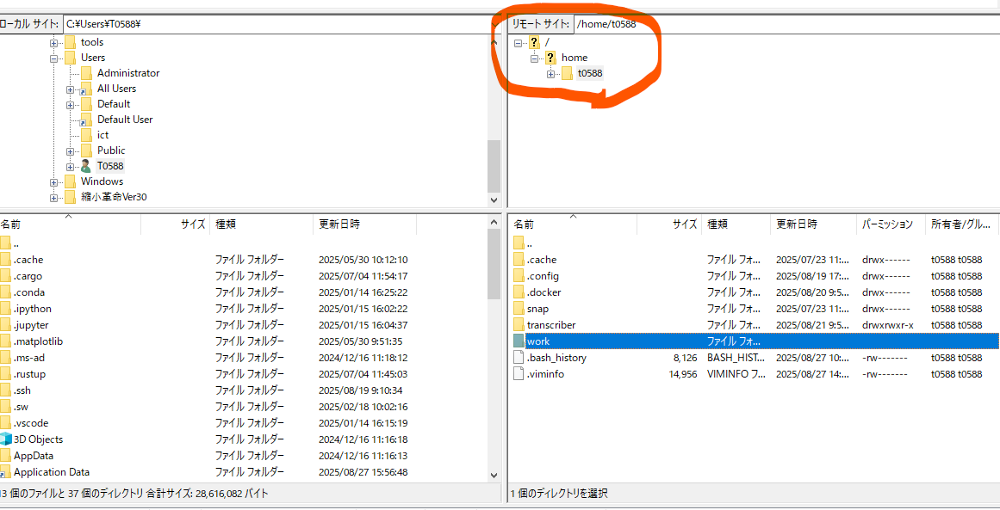

      2. 文字起こし用の作業用ディレクトリ（例 work）がなければ、右クリック→「ディレクトリの作成」を選び、任意の名前（例 work）で作成します。<br>
        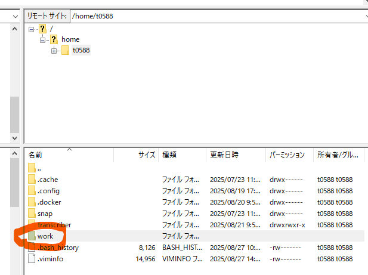
    
      3. 作業用ディレクトリを開いた状態にします。<br>
        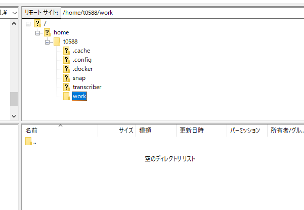

    ③ 音声ファイルの転送
      1. 左側（ローカルPC）のウィンドウで、転送したい音声ファイルがある場所を開きます。<br>
        ※ファイルパスを入力したらファイルサーバー上のファイルにもアクセスできます。<br>
        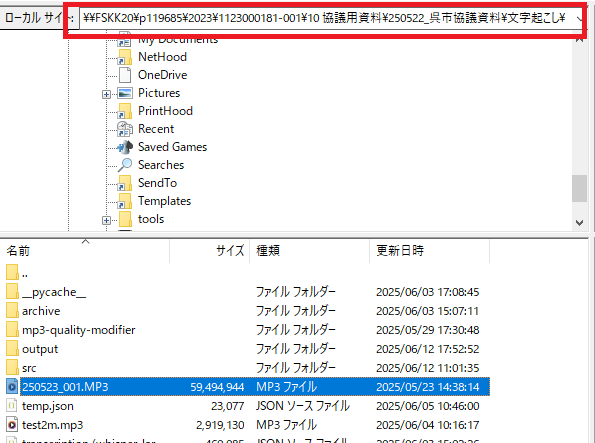

      2. ファイルを選び、右側サーバー上の作業ディレクトリにドラッグ＆ドロップします。<br>
        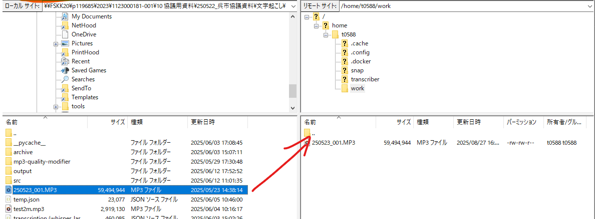

---

2. PowerShellでSSH接続

    ① PowerShellの起動
      1. Windows画面左下の検索欄で「PowerShell」と入力し、アプリを起動します。<br>
        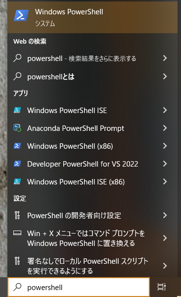

    ② サーバーへの接続
      1. 以下のコマンドでサーバーに接続します。
        （ユーザー名とホスト名/IPは自分用のものに置き換えてください）

            ```bash
            ssh ユーザー名@ホスト名

            // 例
            ssh t0588@10.1.185.55
            ```

      2. パスワードを求められたら、正しく入力してEnterキーを押します。

      3. `Welcom to Ubuntu`などの表示がされたら、Linuxサーバーにアクセスできています。<br>
        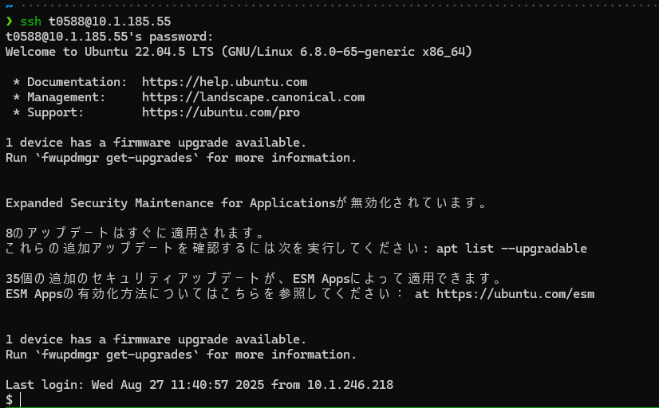

---

3. 文字起こし用スクリプトの設置

    ① 文字起こし用スクリプトの有無を確認
      - サーバーで以下のコマンドを入力し、スクリプトがあるか確認します（スクリプト名：transcriber.sh）:

        ```bash
        ls ~/transcriber.sh
        ```
      - 「No such file or directory」と出たらスクリプトがありません。以下の手順でスクリプトをLinuxサーバーにコピーしてください。

    ② FileZillaでスクリプトを転送
      1. FileZillaでご自身のLinuxサーバーのホームディレクトリを開きます。<br>
        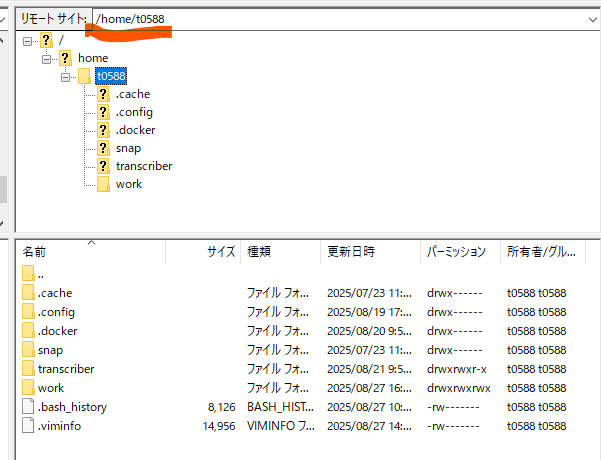

      2. ファイルサーバー上のスクリプトファイル（\\\\fskk20\\c119685\\音声文字起こし\\transcriber.sh）をドラッグ＆ドロップしてホームディレクトリへコピーします。<br>
        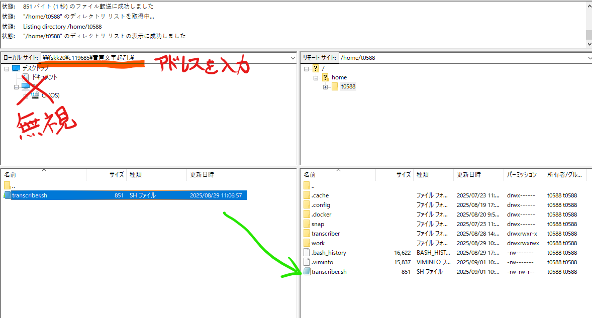

    ③ スクリプトの実行権限を与える
      - PowerShell（SSH接続中）で次のコマンドを打ちます：
        ```bash
        chmod +x ~/transcriber.sh
        ```

---

4. 文字起こし用スクリプトを実行

    ① サーバーの稼働状況を確認する
      1. SSH接続中のPowerShellで、次のコマンドを入力します。
            ```bash
            docker stats
            ```
      2. `app-transcriber_<日付_時刻>`という名前の処理が2つ以上稼働していた場合、処理数が1つ以下になるまでしばらくお待ちください。<br>
         - 処理数が1つ以下の時は、次のステップに移ってください。
         - この基準は今後変わる可能性があります。

         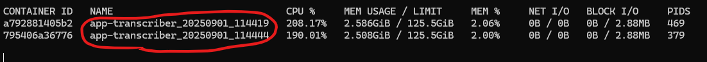

    ② 実行コマンドの入力
      1. SSH接続中のPowerShellで、次のコマンドを入力します（各値は実際に利用するものに置き換えてください）。

          #### 話者分離機能なしの場合

          ```bash
          ~/transcriber.sh \
          作業ディレクトリ名 \
          モデル名 \
          音声ファイル名 \
          出力名

          （例）
          ~/transcriber.sh \
          work \
          whisper-large-v3 \
          audio01.mp3 \
          result01
          ```

          #### 話者分離機能**あり**の場合

          ```bash
          ~/transcriber.sh \
          作業ディレクトリ名 \
          モデル名 \
          音声ファイル名 \
          出力名 \
          diarize

          （例）
          ~/transcriber.sh \
          work \
          whisper-large-v3 \
          audio01.mp3 \
          result01 \
          diarize
          ```

      2. コマンドを実行すると処理が始まり、完了後は作業ディレクトリ内に出力ファイル（出力名.txt）やログファイル（transcriber.log）が保存されます。

         - 文字起こし処理中にPowerShellを閉じた場合でもサーバーで処理は継続します。
         - 処理の状況（進捗や処理が成功したかどうか）は`transcriber.log`に保存されるので、FileZillaでローカルPCにコピーして、状況を確認することができます。
         - エラー等で処理が失敗した場合は、`transcriber.log`を開発者に渡して、対応を依頼してください。
         
         #### 正常に処理が完了した時の表示（例）
         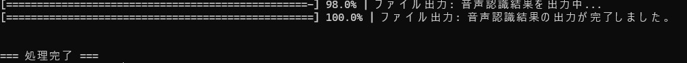

         #### 作業ディレクトリの様子（例）
         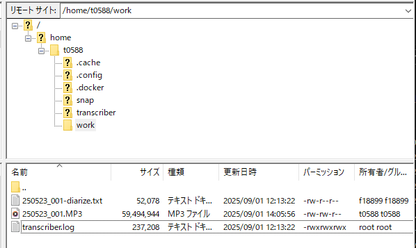
         
          ---

          ### モデル名・オプションについて

          - **モデル名**  
            コマンドの「モデル名」には、文字起こし処理に利用するAIモデルを指定します。現在は `whisper-large-v3` のみが利用可能です。他のモデル名を指定しても動作しませんのでご注意ください。

          - **その他オプション**  
            コマンド末尾の「diarize」などは追加機能（例：話者分離）を有効にするためのオプションです。今後、他にもオプションが追加される可能性があります。新しいオプションが利用可能になった場合は、担当者から案内があります。

---

5. 結果ファイルのダウンロード

    ① FileZillaで結果ファイルを取得
      1. FileZilla右側ウィンドウで作業ディレクトリ（例: work）に入り、目的のファイル（例: result01.txt, transcriber.logなど）を探します。

      2. 取得したいファイルを選び、左側（ローカルPC側）の保存したい場所へドラッグ＆ドロップしてコピーします。

         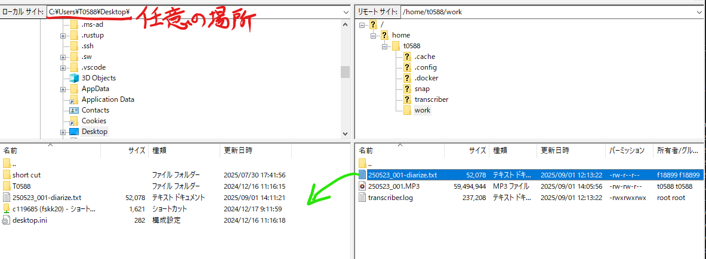

---

<br>

# トラブルシューティング・豆知識
- SSHやファイル転送でエラーが出た場合、「ユーザー名」「ホスト名」やパスワードの再確認、ネットワークの接続状況などを見直してください。

- サーバー上のコマンドは半角英数で入力します。

- 操作に不安がある場合や、わからない箇所、解決できない問題がありましたら、画面をスクリーンショットしながら進め、記録を取っておいてください。

- わからない場合や失敗した場合は、担当者にご連絡をお願いします。